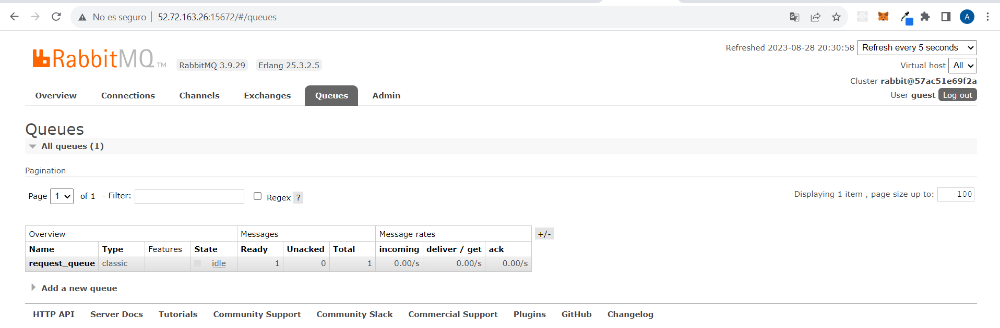

# API Gateway y Microservicios - ST0263

## Estudiante(s):
- Nombre: ANDRES GUERRA MONTOYA
- Correo Electrónico: aamontoya@eafit.edu.co

## Profesor:
- Nombre: EDWIN NELSON MONTOYA MUNERA
- Correo Electrónico: emontoya@eafit.edu.co

---

# API Gateway y Microservicios - Descripción del Proyecto

## 1. Breve Descripción del Proyecto

Este proyecto consiste en la implementación de un API Gateway que interactúa con dos microservicios (mserv1 y mserv2) mediante gRPC y RabbitMQ. El API Gateway actúa como intermediario para recibir y enviar solicitudes a los microservicios correspondientes. Toda la infraestructura fue subida a AWS donde se debio configurar la IP elastica del API Gateway y sus reglas de seguridad para que recibiera peticiones por los puertos 5000, 5001 y 5002.

### 1.1. Aspectos Cumplidos o Desarrollados

- Implementación de un API Gateway que maneja las solicitudes de los usuarios.
- Interacción con los microservicios mserv1 y mserv2 mediante gRPC.
- Lanzamiento de instancia de AWS.
- Configuracion de reglas de seguridad de la instacia

### 1.2. Aspectos NO Cumplidos o Desarrollados

- Uso de RabbitMQ para encolar y procesar solicitudes asíncronas para cuando gRPC no funcione. Se crea la cola pero el canal de comunicacion aparece cerrado.

## 2. Información General de Diseño y Tecnologías Utilizadas

Este proyecto utiliza una arquitectura de microservicios, donde el API Gateway actúa como punto de entrada y los microservicios realizan cada uno una tarea específica. Se emplean gRPC para la comunicación entre el API Gateway y los microservicios, y RabbitMQ para la gestión de solicitudes para cuando la comunicacion gRPC no este funcionando.

## 3. Descripción del Ambiente de Desarrollo y Técnico

- Lenguaje de Programación: Python
- Librerías y Paquetes: grpc, flask, pika, threading, dotenv

### Compilación y Ejecución

Lo primero es abrir 4 terminales y en cada una hacer lo siguiente
#### Primera instancia
- cd AndresGuerraMontoya-st0263
- python3 

#### Segunda instancia
- cd AndresGuerraMontoya-st0263
- python3 mserv1.py 

#### Tercera instancia
- cd AndresGuerraMontoya-st0263
- python3 mserv2.py 

#### Cuarta instancia

- docker run -it --rm --name rabbitmq -p 5672:5672 -p 15672:15672 rabbitmq:3.9-management

### Detalles del Desarrollo y Técnicos

- Se han creado clases para gestionar la interacción con los microservicios utilizando la tecnología gRPC.
- El API Gateway dirige las solicitudes hacia los microservicios mediante el uso de solicitudes HTTP.
- Cada uno de los microservicios cuenta con su propia funcionalidad diseñada para enumerar y buscar archivos en una carpeta específica.

### Pantallazos de los resultados

- Error gRPC

- Cola en RabbitMQ

- mserv1

- mserv2

## 4. Descripción del Ambiente de Ejecución en Producción

- Lenguaje de Programación: Python
- Librerías y Paquetes: grpc, flask, pika

- blinker==1.6.2
- click==8.1.7
- colorama==0.4.6
- Flask==2.3.2
- grpcio==1.57.0
- grpcio-tools==1.57.0
- importlib-metadata==6.8.0
- itsdangerous==2.1.2
- Jinja2==3.1.2
- MarkupSafe==2.1.3
- pika==1.3.2
- protobuf==4.24.1
- python-dotenv==1.0.0
- Werkzeug==2.3.7
- zipp==3.16.2

### IP

- http://52.72.163.26:5000/listar_archivos
- http://52.72.163.26:5000/buscar_archivos/nombre-archivo
- http://52.72.163.26:5000/

### Guía de Usuario

[Instrucciones para que los usuarios utilicen la aplicación]

## 5. Otra Información Relevante

[Cualquier otra información relevante sobre el proyecto]

## Referencias

- https://grpc.io/
- https://www.rabbitmq.com/documentation.html
- https://www.youtube.com/watch?v=iQ4kENLfaNI&list=PLalrWAGybpB-UHbRDhFsBgXJM1g6T4IvO&ab_channel=jumpstartCS
- https://rutan-medellin.udemy.com/course/protocol-buffers/learn/lecture/11462860#overview
- https://rutan-medellin.udemy.com/course/grpc-nodejs/learn/lecture/16674820#overview
- https://www.youtube.com/watch?v=GwKz4LGeWiI&t=1s&pp=ygURZ3JwYyBweXRob24gZmxhc2s%3D
- https://www.youtube.com/watch?v=bXE87e2ZtnY&t=377s&pp=ygURZ3JwYyBweXRob24gZmxhc2s%3D
- https://www.youtube.com/watch?v=E0CaocyNYKg&t=1422s&pp=ygURZ3JwYyBweXRob24gZmxhc2s%3D
- https://www.youtube.com/watch?v=WB37L7PjI5k&t=1046s&pp=ygURZ3JwYyBweXRob24gZmxhc2s%3D
- https://www.youtube.com/watch?v=p23J6NTDhEk&pp=ugMICgJlcxABGAHKBSByYWJiaXRtcSBjb211bmljYWNpb24gbW9tIHB5dGhvbg%3D%3D